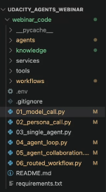
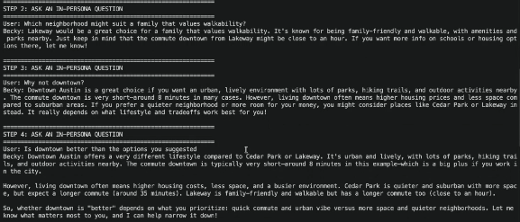
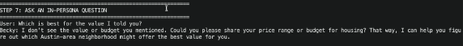
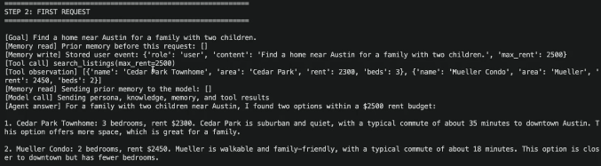
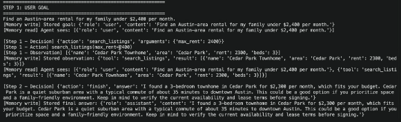

# AI Agents From Scratch Webinar Notes
This is notes on the AI Agents From Scratch Webinar.
The webinar essentially shows how to build an agent that is kind of a 'wrapper' essentially, calling an LLM.
## LLM Connections
Use something like Microsoft Foundry or Gemini API (free).
## Coding Side
Its important to have good structure.
### LLM call
The first file is the model call that essentially calls the agent.
### Persona Call
This second script tells the LLM what it should portray. This narrows done what information the LLM uses. 
Should contain who/what the LLM should portray for a specific use case (e.g. Becky an Austin relocation provider), as well as knowledge it should have.
This 'persona' should also be sent along with the user/system prompts in the LLM call.
After this step the agent should be able to answer some specific questions.
Issue: it doesn't hold memory and merely answers based off of knowledge. so its not a full agent.
### agents, knowledge, and tools
agents: defines agents, especially useful in multiple different agents being used
Agents should be defined with PERSONA, KNOWLEDGE and MEMORY POLICY in a class
PERSONA can serve as a guardrail
knowledge: knowledge/personas for each agent
tools: tools the agent should use such as MCP servers
### Single Agent
Memory is developed here.
Memory has a First Request and setting a goal. This is written to the memmory. The memory can be shared between agents.
Its important to ensure to set token limits within the chat itself.
### Agent loop and Agent Collaboration
Agent loop: agent working with itself
Following the 
Goal -> Decide -> Act -> Observe -> Decide -> Finish

Agent collaboration: execute the agent loop with multiple agents working with each other
### Routed Workflow
One agent directs other agents
Example: Deciding whether or not to use a house agent or a neighborhood agent. 

Overall idea behind the webinar was that agents are wrappers of LLMs and by following a specific framework you can get the best results out of the agent.
Agents should have clearly defined goals. Each agent should be like a job in an organization.
Right now we will use multiple different agents but in the future once AGI comes around it will be like a single know-it-all agent.
[Resource](https://cdn.sanity.io/files/tlr8oxjg/production/cf6f35f2d9ebf47ea6d86de0d2e02cb9e5be2a05.pdf)